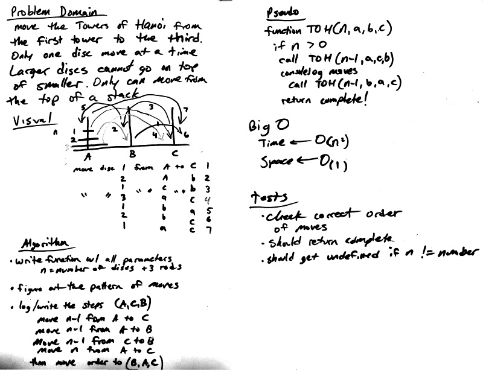

# Towers of Hanoi

This function solves the classic Towers of Hanoi mathematical problem.  The object is to move one sorted stack of discs/plates from one rod/tower to another.  You may only move one disc at a time and it must be from the top of a stack.  A larger disc may not stack on top of a smaller disc.

`towersOfHanoi(n,a,b,c)`

example function call with three discs:

`towersOfHanoi(3,'a','b','c');`

output:

    move disc 1 from a to c

    move disc 2 from a to b

    move disc 1 from c to b

    move disc 3 from a to c

    move disc 1 from b to a

    move disc 2 from b to c

    move disc 1 from a to c

If an interger less than zero is entered for `n` then it will return `enter a valid number`

## Solution
