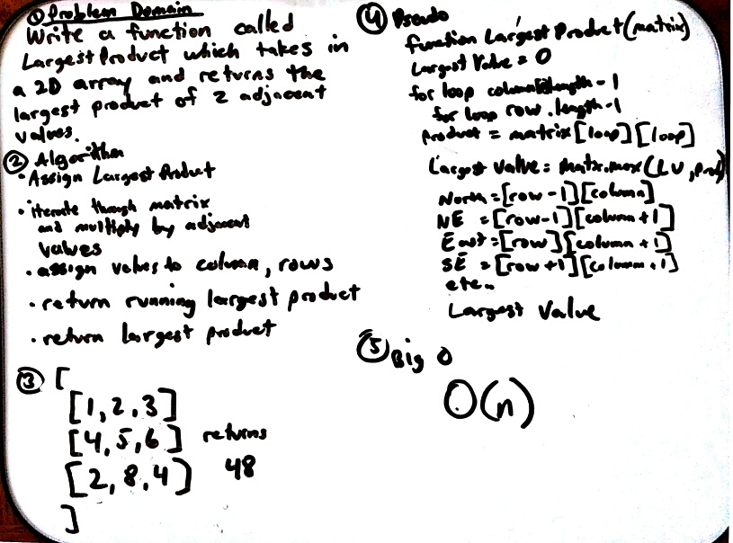

# Array Adjacent Products

The LargestProduct function has an airty of one, an array of arrays, or matrix.  The funcion will return the largest product of two adjacent numbers in the matrix.  Adjacent refers to horizontal, vertical, and diagonal.

    [
    [1,2,3]
    [2,5,8]
    [9,2,3]
    [3,3,9]
    ]
the return value = 45 

## Challenge

The challenge in creating this function is to not use any built in javaScript functions.  `For` loops, `if` statements, and `Math.max()` are used for looping through the arrays and comparing which value is larger.  A series of tests will confirm the function performs as expected.

## Solution

