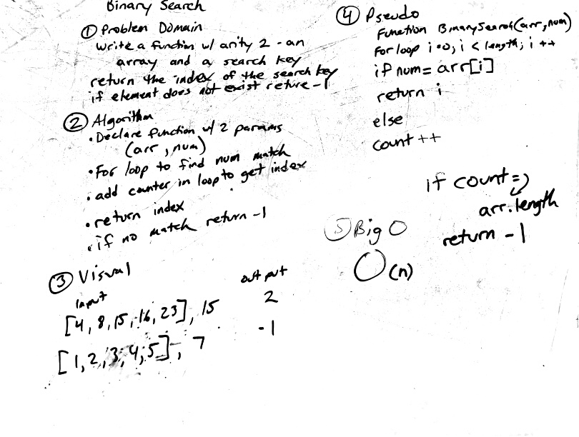

# Array_binary_search

The BinarySearch function has an arity of 2, an array and a search key.  The funcion will return the index of the search key parameter.  If the element does not exist in the array, it will return -1.

    BinarySearch([4,8,15,16,32],16); //returns 3

    BinarySearch([4,8,15,16,32],7); //returns -1

## Challenge

The challenge in creating this function is to not use any built in javaScript functions.  includes() and indexOf() would normally make short work of the task.

## Solution

