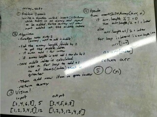

#array_shift

The insertShiftArray function has an arity of 2, an array and an element to insert into the middle index.  The funcion will return an array with the added element in the middle index.  

    insertShiftArray([4,8,15,32],13); //returns [4,8,13,15,32]

    insertShiftArray([4,8,15,25,32],17); //returns [4,8,15,17,25,32]

##Challenge

The challenge in creating this function is to not use any built in javaScript functions.  slice() would normally make short work of this task.

##Solution

