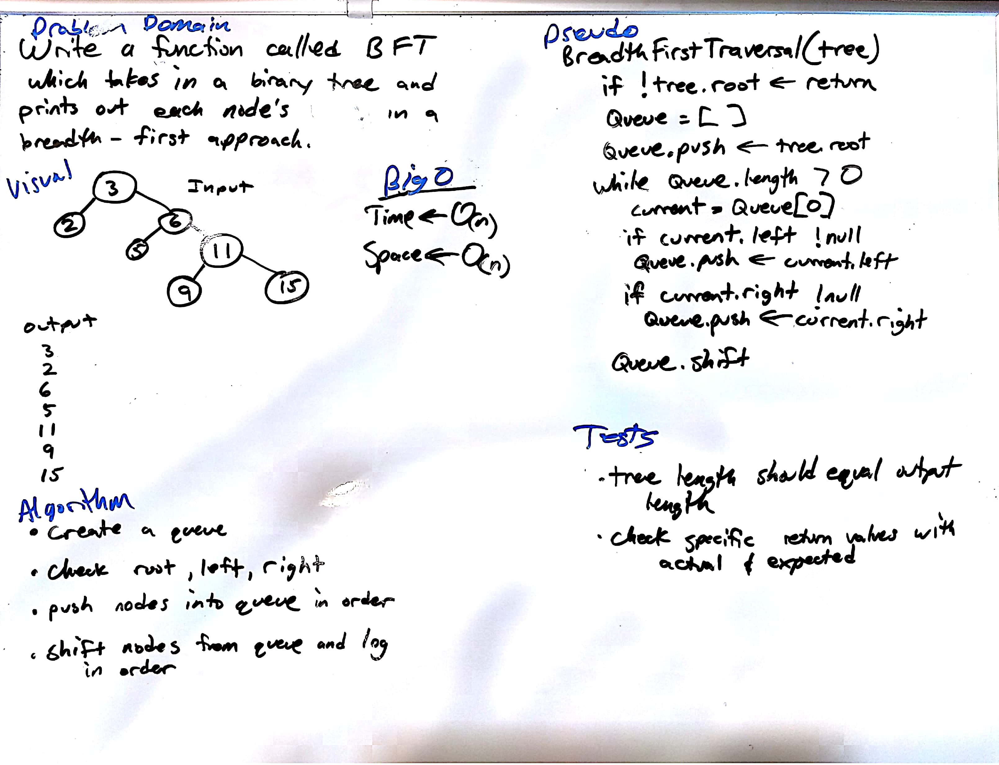

# Breadth First Traversal
---
## Description
This function called `BreadthFirstTraversal(tree)` takes a binary tree as its only argument.  It will traverse the tree in a breadth-first approach and log the value of each node.
## Solution
