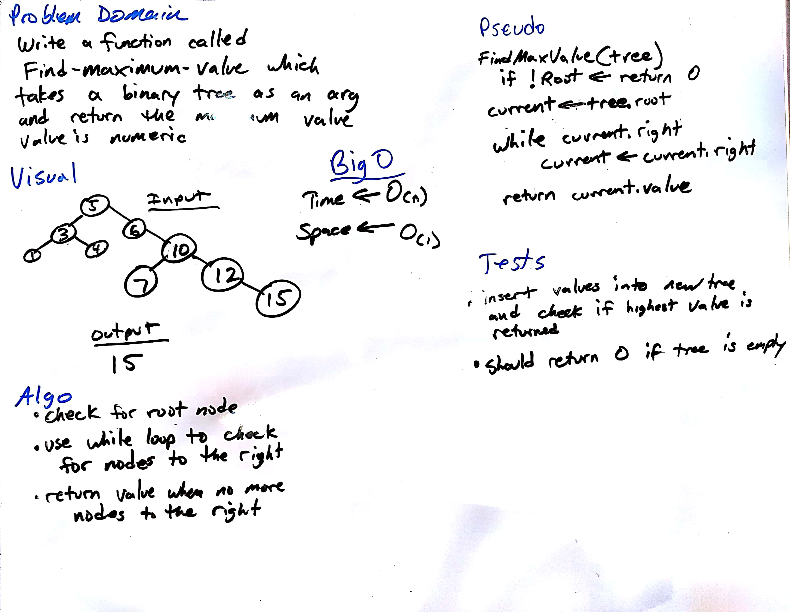

##### TRAVIS please check line 1859 for passing test for this function

# Find Max Value Binary Tree
---
## Description
This function called `findMaxValue(tree)` takes a tree as its only argument.  It will return the highest value in the given binary tree assuming it is a number.  If the tree is empty it will return 0.
## Solution

