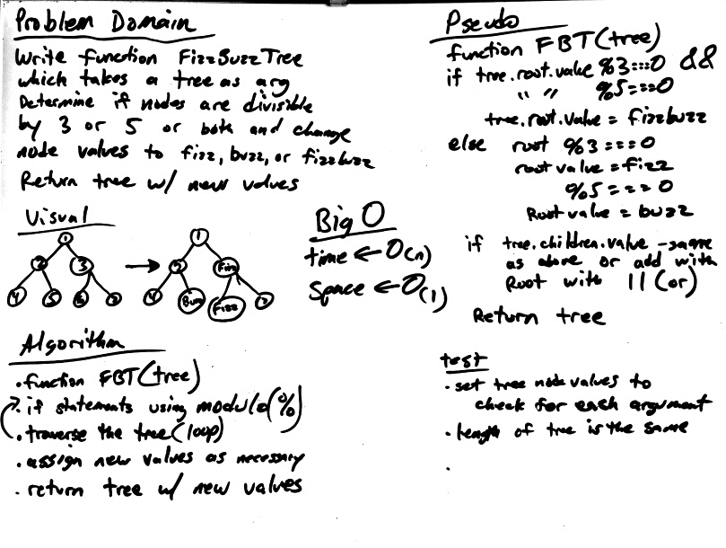

##### TRAVIS please check line 2037 for passing test for this function

# FizzBuzzTree
---
## Description
This function called `FizzBuzzTree(tree)` takes a tree as its only argument.  It will determine weather or not the value of each node is divisible by 3, 5 or both, and change the value of each of the nodes to 'fizz', 'buzz', or 'fizzbuzz' respectively. It then returns the tree with it’s news values.
## Solution
