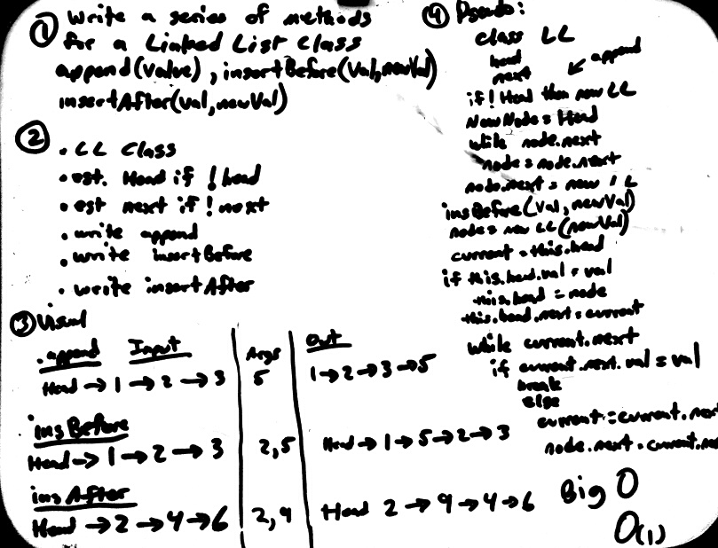

# Linked Lists Insertions
___

This module contains a class **LinkedList** which contains three methods:

The `append()` method adds data to the end of a linked list.  If there is no current head, it will become the head.

The `insertBefore()` method inserts data before a given value in the linked list.

The `insertAfter()` method inserts data after a given value in the linked list.

## Challenge
The challenge is to write and test each of the functions.

## Solution

