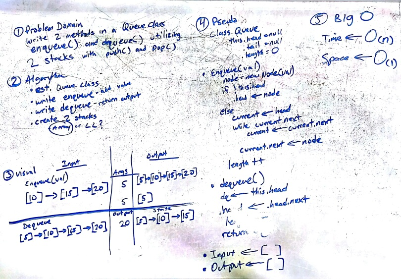

# Queue With Stacks
___

This module contains a class **Queue** which contains two methods:

The `enqueue()` method adds data to the end of the queue.  If there is no current head, it will become the head.  All items in the queue are in a first in first out order (FIFO).

The `dequeue()` method removes and returns the next item from the FIFO queue.

## Challenge
The challenge is to write and test each of the functions.

## Solution

