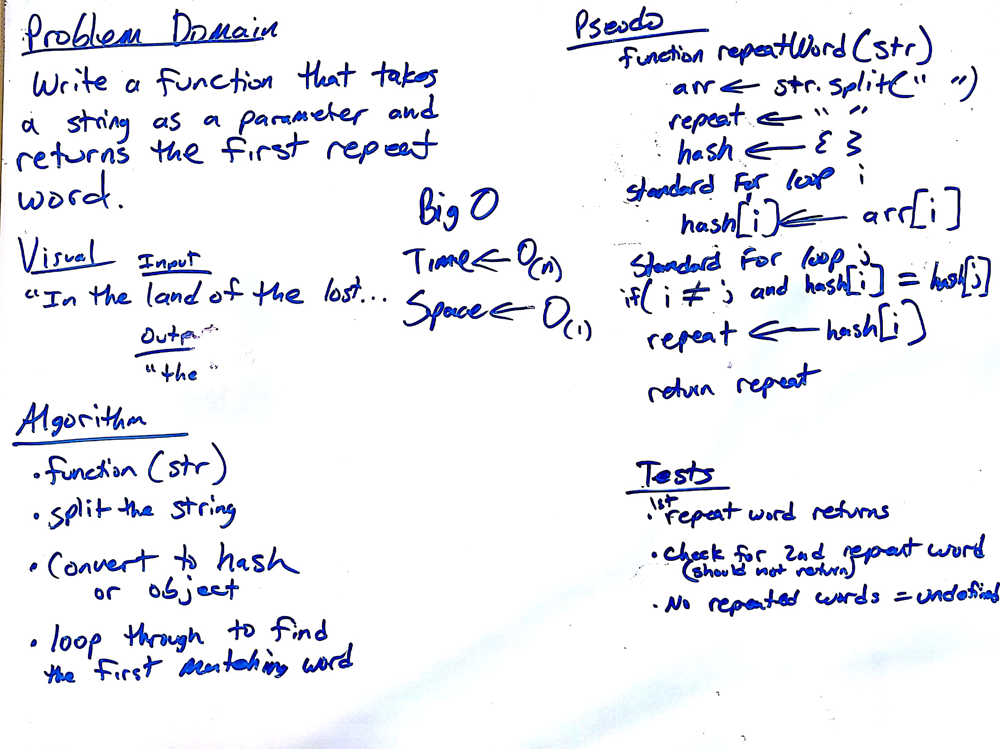

[]

##### TRAVIS (https://travis-ci.org/Lennerblom/data-structures-and-algorithms)

# repeatedWord
---
## Description
This function called `repeatedWord(str)` takes a lengthy string as its only argument.  It will return the first repeated word in the string. It is case and punctuation insensitive.  If there are no repeated words, it will return `undefind`.

### example
`repeatedWord('i was LOST in the woods and lost, forever, but i was ...');`
   ` // returns 'lost'`

---

